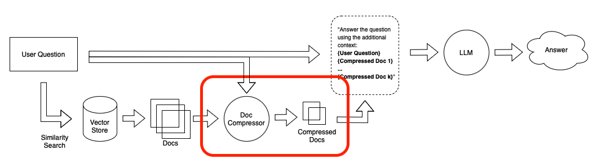

Vector search and vectordb is a popular way to support LLM's longterm memory.
Many use this approach for their LLM application's knowledge base.

**So what is the issue?**

Vector search --> Similarity, not Synonymy. Using this, we get great *recall* for the search results, but
we also get unsatisfactory *accuracy*

Using similarity search, when we are searching for documents about *what Brian does at the office in Philadelphia*, we might
just get a bunch of documents about *what Ryan does at the office in Philadelphia* or *what Brian does at the office in Pittsburgh*.

**How to deal with it?**

This is actually more like a traditional NLP problem, instead of a problem that is LLM-specific. However, a LLM specific challenge is that, LLMs inevitably caps the number of tokens in input (4096 for example), thus it is important to have an accurate first query/input.

In text search, we can do keyword search and then grab the documents that contain the keywords and then perform semantic search. A great discussion on hybrid approaches is [Text search vs. Vector search: Better together?](https://towardsdatascience.com/text-search-vs-vector-search-better-together-3bd48eb6132a).

Another way would be re-ranking the search results based on a combination of vector similarity and relevance scores can also help improve accuracy. This involves using machine learning techniques to train a model that can predict the relevance of a document to the user's query based on various features, such as the similarity of the document's vector representation to the query vector, the frequency of the query terms in the document, and other contextual factors. The model can then be used to re-rank the search results to prioritize the most relevant documents at the top of the list.

Langchain recently introduced Contextual Compression to improve document retrieval -- [Improving Document Retrieval with Contextual Compression](https://blog.langchain.dev/improving-document-retrieval-with-contextual-compression/), [Contextual Compression Retriever](https://python.langchain.com/en/latest/modules/indexes/retrievers/examples/contextual-compression.html). The basic idea is to reduce the volume of the data retrieved by compressing and filtering the documents retrieved by vector search -- only the contents with the highest relevance will be fed into the LLM. One discussion using the Japanese manga "Kingdom" is here -- [LangChainの新機能Contextual Compression Retrieverを試す](https://note.com/mahlab/n/n7d72e83904cc).

