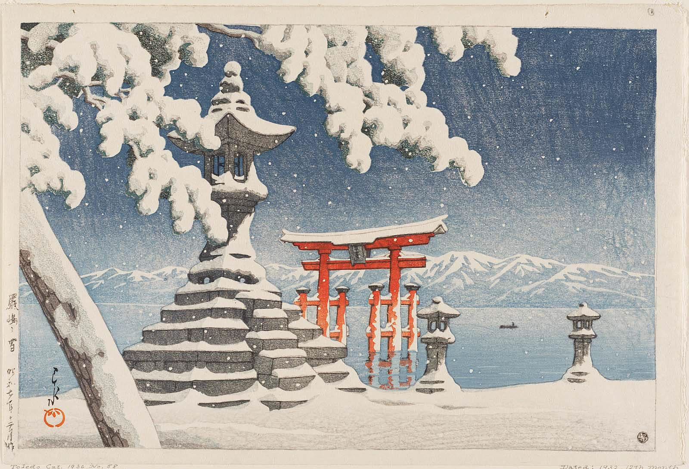
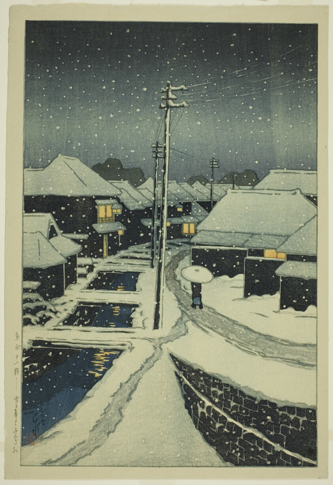
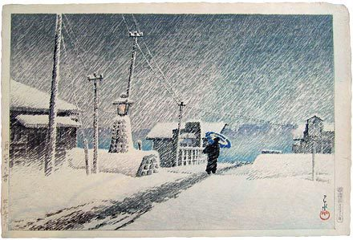

「降り落ちた雪もまた吹き上げられて、白い布のように飛ぶ。」ーー川端康成

Yasunari Kawabata (川端康成) described snow in many forms and in many contexts. I hadn't seen snow with my own eyes until I turned around 14-15 on a trip to a mountain near my city, where people would go for skiing, so I couldn't really connect Yasunari's depiction with solid images in my head, but with some imaginary, inconsistent scenes that were created upon films, documentaries or books I had seen.

When I grew up into my adulthood, having seen real snow many times, I came across "Snow at Itsukushima" (「厳島之雪」)  and it filled the void or the obscurity I once had about Yasunari's works, along with my own memories of snow.

I haven't been to Japan until my 20s. That is probably part of the reason Kawase's paintings weighed this much to me when I thought of snow in Yasunari's works. By admiring the paintings of Kawase, the scenaries solidified and created lingering emotions that resound whenever the snow enters my sight.

「国境の長いトンネルを抜けると雪国であった。夜の底が白くなった。」-- This is the classic beginning of Yasunari's snow country. In English, this is usually translated as "The train came out of the long tunnel into the snow country. The earth lay white under the night sky." However, there is a nuance here -- the Japanese/original version actually gives the reader a pointer of view from on the train, versus the translated version which depicts the train moving from a bystander's view. This little nuance here actually solidied my perception of snow whenever I ride a train or drive a car through the snow – I feel connected with Yasunari's words. On top of that, Kawase's paintings fused the reality, Yasunari, my imagination and the snowy void that resides in my senses, all together, and installed this chain of feelings I feel when it snows.

Yasunari is not the only author that shapes my imagination about snows. Mishima Yukio(三島由紀夫)'s _Spring Snow (春の雪)_ also imprinted the "images" of spring snow in my mind. The main character young Kiyoaki walked through the spring snow to look for his lover, and his 幼馴染 Satoko, in a convent. The effort was in vain and Kioyaki got sick and passed away soon after. The tragedy added another layer to the spring snow. A fraction of sadness towards the uncertainties in life is sometimes felt when I walk alone through the snow.

Tanizaki Junichiro (谷崎潤一郎)'s _Sasameyuki, or Light Snow (細雪)_ , painted the life of an Osaka family in a turbulent time. The novel itself does not really have much to do with snow, but Tanizaki always had the most beautiful and specific writing of the poetic things in life – which is, basically most of the little things, minor events, interactions among people. Tanizaki exemplified the classic Eastern taste of the beauty peacefully shimmering in the details of the most familiar corners in one's everyday life. Tanizaki showed the path to discover and enjoy them without extravagant use of words. For me, enjoying the snowfall is a quiet activity, without any noise, physically or mentally. Tanizaki's way of laying out the scenaries and Kawase's depiction of the silent snows secretly collided in my heart and burst, little by little, into a stream of the most tranquil perception of the snows.

