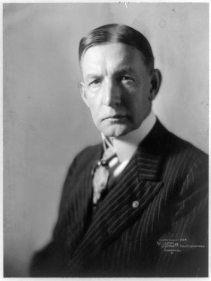

This is the root note of the book *1931: Debt, Crisis, and the Rise of Hitler* by Tobias Straumann, along with my digest and thoughts (In _italic_ if not otherwise mentioned).

Links to notes:
- [Timeline and People](./1931-timeline)
- [Note 1 - Chapter 1 and 2](./1931-initial)
- [Note 2 - Chapter 3~](./1931-note2)

# Chapter 1 - Laughing at the Raven
The raven of Zurich, Felix Somary, foresaw the collapse of world economy.

- Felix Somary gave accurate prediction on the econ collapse. Well-trained economist with a rich practical experience as a banker and a political adviser.
- The Dawes Plan, the Young Plan, German Reparations, and Inter-allied War Debts 1921-1936 
- In late 1923, with the European powers stalemated over German reparations, the Reparation Commission formed a committee to review the situation. Headed by Charles G. Dawes (Chicago banker, former Director of the Bureau of the Budget, and future Vice President), the committee presented its proposal in April 1924. Under the Dawes Plan, Germany’s annual reparation payments would be reduced, increasing over time as its economy improved; the full amount to be paid, however, was left undetermined 
- In the autumn of 1928, another committee of experts was formed, this one to devise a final settlement of the German reparations problem. In 1929, the committee, under the chairmanship of Owen D. Young, the head of General Electric and a member of the Dawes committee, proposed a plan that reduced the total amount of reparations demanded of Germany to 121 billion gold marks, almost $29 billion, payable over 58 years.
- Germany ←[Charge Debts by reparation bills] – Europe –[pay debts]→ U.S
- Felix Somary warned that the Black Thursday in Wall Street and the insolvency of the 2nd largest Austrian and a primary Belgian bank is just the beginning of the downward spiral → international insolvency. The debtor countries’ agriculture and industries took interest rates too high for the short term loans (which prevented Germany from insolvency in the very short term), and the creditor banks would become insolvent because debtors couldn’t pay back.
- Franco-German cooperation was needed but never happened.
- How bad was it going?
	- 1929-32, world industrial production: -36%; didnt come back till 1937; unemployment >10%; prices of raw materials and manufactured goods: -56% and 36%; World trade: -⅔.
	- 1929-32 german industrial production: -50%
	- “The global economy broke up into several currency and trade blocs, bringing an end to an era of globalization”.
- Somary had knowledge, exp and instincts, but no ‘insider’ knowledge. He connected the dots.

By early 1930s, U.S. was the biggest creditor and Germany the biggest debtor. → inter-govermental chain of obligations
- The German Reich, the German state govs, municipalities, banks, and corps had borrowed huge amounts of private funds, especially from Wall Street → to finance economic expansion AND pay a large part of the reparations bill. 
- By 1929, debts owed to foreign banks (RM 31B) - ⅓ of German GDP. 86% if including reparation obligations. → a big chunk is SHORT-TERM (weeks or months).
- 1923 hyperinflation - Hyperinflation in the Weimar Republic preceded the issues
- Weimar Germany -> **a mortgaged democracy**.
	- Needed public support to survive post-war years
	- Borrowing from abroad enabled the authorities to avoid unpopular tax increases, keep workers well paid and postpone the true costs of reconstruction
	- City mayors were launching big infra projects (concert halls, football stadiums,etc.) to boost VOTER loyalty
- One other reason for Germany’s borrowing: some officials in the German Foreign Ministry saw an advantage in accumulating commercial debt owed to US banks.
	- The more you borrow, the more leverage you have → you can threaten your creditors that you might default
Foreign Minister Gustav Stresemann in a 1925 speech: “One must simply have enough debts; one must have so many debts that the creditor sees his own existence endangered if the debtor collapse..”
	- They also think → “The higher our private debt, the smaller our reparations”
- Germany's Economic status?
	- Weimar Germany was still Europe’s most power economy post-war, just recovering
War: 2 million soldiers German dead and 1 million German civilians dead. Danzig etc. to new Poland, Alsace-Lorraine to France.
But not economically/industrially crippled. Still the leaders in coal, iron, steel production, electrical eng, chemical industry, and car making.
	- 1924, restoring the gold-based German currency.
	- Lending to Germany
		- U.S., and all other countries
		-After Fed raised rates in 1928 to cool the stock market boom, lending to GER continued. When Somary was giving talks in Heidelberg in early 1930, US still lending short-term funds to GER
- Why policymakers were not able to stablize GER situation?
	- They were skeptical. They did not accept the premises of Somary.
	- Somary met Keynes in 1926, Somary was insulating his clients from coming crisis even then. But Keynes: “We will not have any more crashes in our time”
Somary: derided as `the raven of Zurich`

Why policy makers were not taking actions to prepare for the economic and political havoc?

- a common hypothesis: they did not see it coming → there's some truth to it.
    - independent economists warned but many politicians indulged themeselves in moralistic lecturing that LACKED BASIC ECONOMIC LITERACY. What's ironic is that, many realized that Germany was on the brink of a financial collapse after the currency crisis triggered by the Nazi Party victory in 1930 Sept. Reichstag elections – they had plenty of time before that. Such **cognitive inertia**. _In a 20/21 century democracy, it is inevitable to see politicians, with or without enough credibility or economic literacy, to get to the center of the stage as long as they find a way to obtain votes._
    - Are the policymakers then incompetent? Not exactly. POTUS Hoover was experienced with a great understanding of Europe's problems. British PM Ramsay MacDonald was eager to push international cooperation. France foreign minister Aristide Briande was one of the most able diplomats. German Chancellor Brüning was a leading expert in fiscal policy.
    - Is it institutional framework within which politicians operated? Most plausible
        - in the early 1930s, the German gov had no room for manoeuvre due to its heavy foreign debt: (War reparations + debt to foreign banks as a result of the borrowing frenzy during the boom years of late 1920s). → When world econ crisis kicks in, the German gov had to pursue austerity policies which further deepend the recession (spending cuts, tax increases, etc.)
        - Another factor is that the the marks were back to the gold standard and the German central bank was required to hold a minimum of 40% gold and foreign exchange reserve against all notes in circulation → no room for easing.

The creditors should and could have relieved Germany of its obligations. But for understandable reasonse (WWI was still fresh, concensus was hard to reach, and the crisis deepened fast), France, UK, USA hesitated and opted for a gradual diplomatic approach. Hoover started an initiative to stop the run on the German currency at the eleventh hour, but too late to prevent the 1931 financial crisis.

# Chapter 2 - A Triumph of Diplomacy
The gradual dipomatic way of tackling issues and debts.

1930 Jan, the second Hague Conference concluded in the Dutch capital with applause from different media. The New York Times chanted: "The festering sore has now been healed. The debates and recriminations are over. The problem has been disposed of."

The politicians, diplomats, etc. gathered in Hague from late 1929 to 1930 to settle the issues of and post war. On 1930/Jan/20, in late afternoon, 500 delegates and experts from nearly twenty countries signed the final protocol and various annexes, accompanied by a military brass band playing solemn tunes. Optimism was everywhere. The Belgian Prime Minister, Henri Jaspar, the British Chancellor of the Exchequer, Philip Snowden, etc., felt that the financial problems had been "permanently settled". This result was through the collective efforts of many diplomats and politicians: Gustav Stresemann, the German Foreign Minister, who passed away in 1929 Oct and shaped German foreign policy single-handedly since 1923; Aristide Briand, who improved Franco-German relations and received the Nobel Peace Prize along with Stresemann in 1926 for concluding the Locarno Treaties (1925) which paved the way for Germany's membership of the Leauge of Nations.

It was not easy to loosen the post-war tensions to reach an agreement for France and Germany. Security (vis-a-vis Germany) was the topmost concern for France, and a revision of the Versailles Treaty and the restoration of pre-war conditions was what Germany sought. Through drinking and smoking togher, and mutual trust, the two leaders made progress. The early death of Stresemann left his successor, Julius Curtius, a former lawyer and son of an entrepreneur who owned and ran two chemical plants, in a spot where he was not well-accpeted and respected by diplomats. But eventually progress was made and some mutual trust was established through the efforts of Curtius, Briand and the newer French Prime Minister André Tardieu.

The centerpiece of the agreements signed in the Hague was the Young Plan – named after the American lawyer and industrialist Owen Young, who had chaired the preparatory experts' commitee meetings in Paris b/w Feb and June 1929. 

- The Versailles Treaty stipulated that Germany alone was responsible for the war and therefore had to "make compensation for all damage done to the civilian population of the Allied and Associated Powers and to their property during the period of the belligerency" → which, obviously did not solve real issues...the same went for the London Ultimatum of May 1921.
- The London Ultimatum made things more complicated (a final bill of 132B gold marks → **~250% Germany's 1913 GDP**)
    - A tranche, 12B gold marks → for war damages directly inflicted on the Allies
    - B tranche, 38B → finance the war debts France and Great Britain owed to the US
    - C tranche, 82B → with a vague justification (they knew this would probably never be paid)
    - But obviously, the A, B tranche's 50B is ~100% Germany's 1913 GDP. This part could be lower if the US wanted to reduce the claims on France and Great Britain – which unfortunately was taboo in Washington.
- From a view of numbers, the reparations could be paid economically – but politically this was not at all plausible. The German public were not convinced that their country had lost the war → tax boycotts, deferrals → the gap b/w tax receipts and government expenditures was covered by banknotes **PRINTED** by the central bank which **accelerated inflation**. The governmenttransferred only the A tranche required by the London Ultimatum, but then virtually stopped paying cash. There was turbulence in the Ruhr region too, in Jan 1923 (Belgian adn French troops), and German gov supported the German workers' passive resistance there with the central bank paying wages by PRINTING MONEY. → **Hyperinflation** (the war and the reconstruction already made the inflation rate high)
- Stefan Zweig (Austrian writer) experienced this hyperinflation too in Viena in 1921-2.
- The Dawes plan took place when the issue got full-blown.
    - 
    - a lawyer, politician, brigadier-general, received Nobel Peace Prize in 1925 and became Coolidge's Vice President.
    - Dawes chaired a committee to make proposals for rescheduling German reparations.
        - lowered the annual installments and provided the Reich with a foreign loan
        - a new currency – the Reichsmark, backed by gold
        - Ruhr's peace
        - Germany to accept some **foreign control**: The Reichsbank and the Reichsbahn(German National Railway) were made independent of the gov and supervised by foreign experts 
    - The Dawes Plan seemed to work well.
        - The loan was underwritten by J.P.Morgen.
        - 1923-1927 German industrial production > doubled.
        - Dow Jones index skyrocketed → an extended boom period. American lending to Europe and Latin America reached record high levels.
        - Investments offered higher interest rates than the US bond market ← Germany was hungry for capital after the hyperinflation
        - hyperinflation's **positive effect**: the Reich had no domestic public debt anymore
        - ⇒ Germany became an El Dorado for foreign investors (mainly US, and UK, Netherlands, Sweden, Switzerland)
    - Issues of the Dawes Plan
        - Defined the annual repayment schedule but did not really help the repayment → the framework's credibility was undermined
            - gave the Reich freedom to delay annual payments (in case the repayments hurt the currency stability)
            - the claims of **private creditors had priority** over reparation → the reparation could always be delayed
        - Foreign supervision of Germany's public finance became harder
        - International imbalance was created
    - The foreign loans were ONLY partially served to make productive investments
        - → a large share ⇒ extend public services to record high levels
        - 1929 - foreign debt→ RM 77B ~ 86% GDP
        - Somary thought the German banking system was 'the weakest link where the collapse will and must occur'.

- 1930 Young Plan tried to end these dangerous developments
    - Founded a Bank for International Settlements (BIS) in Basle; Ended the Allies' oversight of the Reichsbahn and the Reichsbank
    - The Reich had to pay reparations until 1988 → politically counterproductive (Germans in dbt for 3 generations)
    - Changed the transfer protection clause: MUST pay RM 612 million per year → **unconditional annuity**. The rest: RM 1.3B could be delayed for two years.
    - ⇒ **Reversed the ranking** of Germany's foreign debts 
        - ⇒ Borrowing from abroad was now difficult
        - Reparations first, private debts second
    - 1929 - German econ → recession
        - The new policy worsened it.
        - Budget and trade surpluses were needed to pay debts → need budget cuts, higher taxes and lower wages and prices
        - ⇒ basically reducing domestic demand in a time of crisis
        - ⇒ Failure of the Young Plan
    - The country was not even in a position to pay its own civil servants' salaries
    - April 25, 1929, the Reichsbank → drain of reserves and raised the official interest rate to 7.5% 
        - → Commercial bankds met serious liquidity shortages already
        - The Reichsbank refused to accept the treasury bills of the Reich.
    - Hilferding, the (Social Democratic) Finance Minister, needed 100M Swiss francs to pay the salaries of civil servants → begged Somary to help