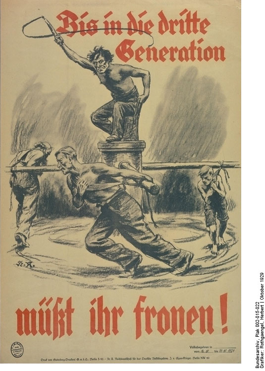

# Chapter 3 - Strong Cards to Play
1930/Mar/12, two months after the Second Hague Conference, the Reichstag, the first chamber of the German parliament, passed the Young Plan with a clear majority.

Chancellor Müller, a 54-year-old Social Democrat, found it difficult dealing with the radical right and the radical left – they kept interrupting the parliament debates.
- Joseph Goebbels, the head of the Berlin district of the National Socialist German Workers' Party (NSDAP)
- the radical rights (+German National People's Party (DNVP)) oppose the Young Plan, and a German-Polish agreement stipulating that Ger and Pol renounced all financial claims, both public and private, stemming from the world war and the Versailles Treaty.
- ⇒ became a campaign, including a draft bill from the rights → renouncing the recognition of 'war-guilt', opposing new reparations etc.
    - didn't pass, only 15% voters voted on it (required 50%), but 95% of them were in favor.
    - Hitler profited a lot: in 1928 Reichstag elections NSDAP won 2.6% (3% in 1924), but he became part of the inner circle of Hugenberg's Reich Committee (Hugenberg, the chairman of the DNVP, lobbyist and businessman)
    -  (1929/Dec "Until the third generation you will have to labour")
- Far left: Communists were also against the Young Plan
- Biggest political power in the Reichstag - the Grand Coalition, 301 out of 491 seats, 5 major parties (SPD, DDP (the German Democrats), the Centre Party (Zentrumspartei), the Bavarian People's Party (BVP), and the German People's Party (DVP))
- 139 out of 491 seats were radical - 12 by National Socialists, 73 by DNVP, 54 by the communists.
- So  the Grand Coalition was still winning… yet.
- Paul von Hindenburg, President of the German Reich, signed the Young Plan bill one day after the parliamentary session
    - A typical Junker class, participated in the Franco-Prussian War of 1870/1
    - He knew that supporting the Young Plan was putting his prestige at risk → he wanted to win both institutional power and public admiration