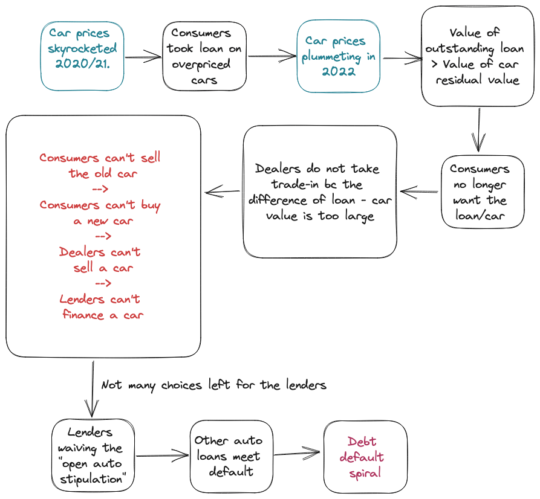
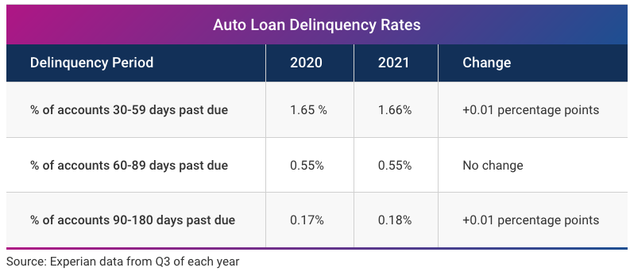

What is going on with auto loan?

Today, there is a popular tweet thread from @GuyDealership -
["This morning I discovered something \*extremely\* alarming happening in the car market, specifically in auto lending."](https://twitter.com/GuyDealership/status/1603794722140688384) or read it as a [thread](https://threadreaderapp.com/thread/1603794722140688384.html).

The major point is that we might be seeing auto loan getting dumped and cars not getting sold while the car prices plummeting.

#  What is happening? And what can happen further?
The tweet thread has explained in a clear and laymen friendly manner. I ain't gonna rephrase it. But here's a diagram I created that might just help with understanding the problem.

#  How bad can it be?
To answer this, one would want to know a couple of things.

1. When/ How soon this can happen?
2. How fast will things collapse if it happens?
3. How big is it? What is the scale?

When/ How soon this can happen?

A giant bubble burst might just never happen.

First of all, what percentage of the outstanding car loans falls into the above category and is likely to default? There is no concrete data but I highly doubt there will be a significant percentage. 2008 GFC's loan issue is different in many ways, but one of aspects is that it was based on houses and the auto loan issue is based on automobiles. people would think of houses as investments because houses do not have a nature of automatic depreciation, and on the contrary, cars do. Back then people rushed into the housing market. People with questionable credit history were able to borrow and purchase a number of houses. Nothing like that will happen in the automobile market due to the nature of automobiles.

Second, is this a leveraged issue? We all know that GFC happened partially because of overly leveraged Asset-Backed Securities (ABS). This over leverage seems to be absent in the auto loan market. If this statement holds, then it doesn't seem likely that the possible defaults will have a significant blast radius.

Third, if we look at some existing data ([This July 2022 article](https://www.experian.com/blogs/ask-experian/research/auto-loan-debt-study/)), it doesn't seem plausible that there will be a drastic disaster that is pending, although 2022 has seen drastic macro conditions changes and dramatic market movements. For example, auto delinquencies was stable in 2001:

However, this is not to say that nothing can happen. It is likely that 2023 will see a significant number of auto loan defaults and surging auto loan delinquencies. It is just that given the current context, the auto loan situation is not likely going into a full-blown disastrous history event. Across 2023-2024, it can become a noticeable issue in the worsening macro environments and be intensified by many other economic factors.

How fast will things collapse if it happens?

If things indeed collapse, the implosion can take effect rather fast. This is based on the assumption that a significant auto loan issue will happen only when it gets intensified by other economic and market factors like recession. When auto mobile demand goes drastically down, the lenders will run into a continuous issues as the debt default spiral intensifies.

How big is it? What is the scale?

We need to distinguish the full potential scale and the reasonably possible scale. As discussed above, it is not likely that we see a full blown auto loan "crisis" in a 1.5+ trillion auto loan market, even in the worst case. The full potential scale of this will be way smaller than the whole auto loan market.

Again, this could be one of the implosions 2023-2024 might witness, but it is unlikely to be the tigger, nor the catalyst.
