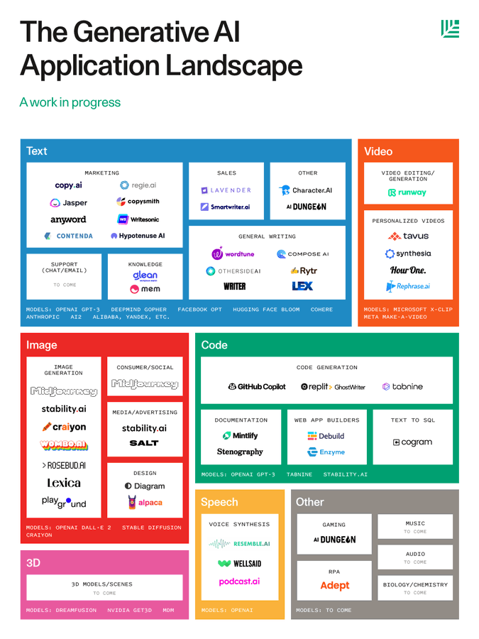
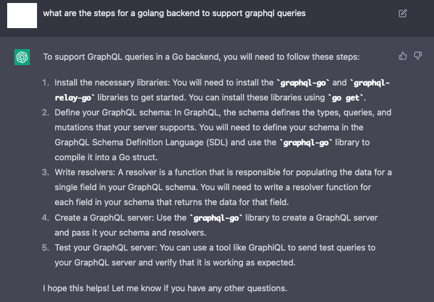
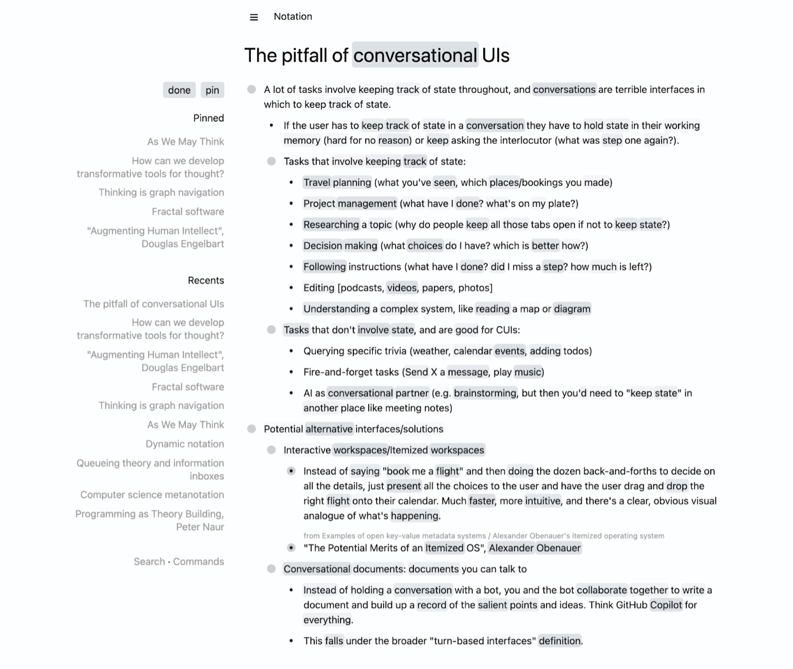

Some lists of use cases (and maybe examples) of chatGPT (and other AI tools) are maintained and updated here.

Use cases are categorized into three ratings:
1. Great - really useful
2. Good - good to use, might have some glitches
3. Meh - Not necessarily useful, might be usable, and might be totally usable (but putting the case here means that there's a valid use case for it)

# Resources
General
- chatGPT
- [Merlin](https://merlin.foyer.work/) 

Coding
- Github CoPilot (Codex)
- Tabnine
- Mintlify

Text/Writing/Reading
- novel AI
- mem.ai
- copy.ai
- Jasper

Audio
- writesonic.com
- otter.ai
- [sonix.ai](https://sonix.ai/)
- [fireflies.ai](https://fireflies.ai/)

Others
- You.com

There is a good current landscape FYI –

# Coding/Programming

Great:
1. Starter code / boilerplate code → this is a great use case, say if you are not familiar with a certain language, but you are learning or you are implementing a piece of code for a defined set of demands, chatGPT can give you a good starting point if you get your prompt right
2. Get steps for implementing a functionality or a common pipeline – 
3. Explain code (the whole logic, some specific details, confusion about syntax, etc.)
4. Improve code - use specific demands 
    - rewrite using the correct convention/style
    - reformat code, for e.g. make a python program more Pythonic; or simplification
    - performance
    - rewrite using other ways
5. Ask for some small ready-to-use code/command snippets (Git commands, bash commands, etc.)

Good:
1. Write tests - unit tests, etc.
2. Add documentation 
3. Directly point out errors in a piece of code and ask chatGPT to fix it
4. Translate code from Lang-A to Lang-B

Meh:
1. Debug code – chatGPT can detect some easy bugs (for e.g., given the requirements for a program, and ask chatGPT to see if the program meets the requirements). But this is not to say that currently AI assisted coding tools do not deal with bugs well – they are just not good at elusive ones. Tools like [Adrenaline](https://github.com/shobrook/adrenaline) (which is based on OpenAI Codex) is great.

# Reading, Notation
Yes, reading.

Some of these AI tools can help you read. How?
(https://twitter.com/danshipper/status/1612509256820867073 is a good note on this)

1. Some reading methods can help you read faster - https://bionic-reading.com/
2. Auto tagging and linking - 
3. Automatically enriching and synthesizing notes – for e.g., adding context and related info to your succinct notes
4. A super - Anki: a mix of Roam, Notion and Anki → better formatted network of concepts and information with fine-grained auto repetition → could be a killer app.
5. A personal dashboard that evolves by itself – essentially a workspace, way more than just taking notes: mem.ai is more or less doing it

Great:
1. Paraphrase a text
2. Explain certain points/sentences
3. Ask AI to create questions for you to answer - so that you get a better understanding. And ask for answers to double check.

# Writing
Great:
1. Tools like novel AI definitely works out for content creators.
2. Note taking (summarizing and highlighting, beyond transcription) for recordings/audio. → This helps people with hearing difficulties a lot - living with Auditory Processing Disorder, I could definitely make great use of it. → Tools like Otter.ai are more or less doing this.

Good:
1. Grammarly. → Generally useful for a lot of folks although I'm personally not using it.
2. Transcrption tools. → Transcribing texts is not a rare use case.

Meh: